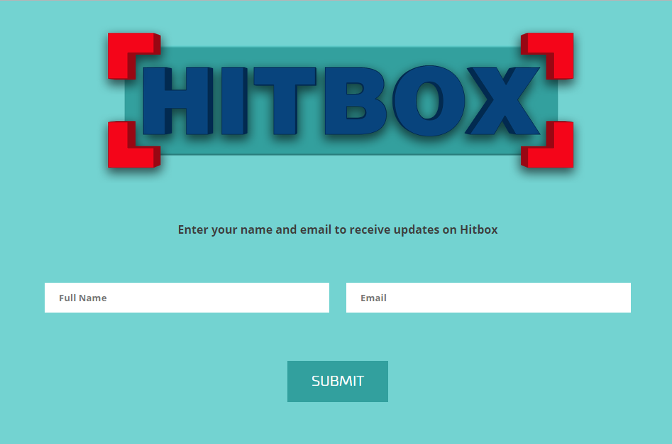

#HitBox Event SignUp Screen

A little app I made for collecting emails at events where we're showing off [HitBox](http://playhitbox.com).

I wanted to learn more about functional programming so I decided to do it in Elm, purely so I could learn about how functional web apps work.

